# Linux

---

---

## 入门篇

---

### 1、Linux概述

#### 1.1 概述

- Linux是一个操作系统（OS）

  > 底层的**系统软件**

  > 当今三大流行操作系统
  >
  > 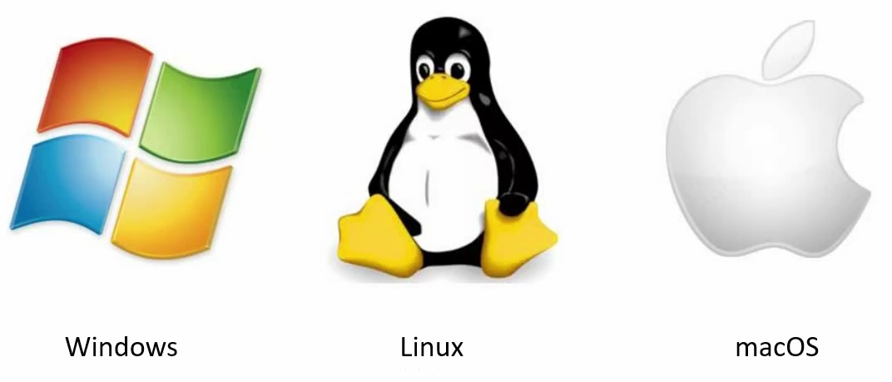
  >
  > > 图中的企鹅名字叫Tux，显得自由散漫、无拘无束

#### 1.2 Linux的诞生

- *Linus Torvalds*

  - 上大学时对Unix产生兴趣
  - 91年初开始基于Minix（Unix的变种）进行开发
  - 1991年6月，确定开发一个类Unix操作系统内核
  - 1991年9月，开发完成内核的0.01版本，命名为Linux

- *Linux* 与 *Unix* 的渊源

  - Unix由贝尔实验室开发，==分时操作系统==

    > 在这之前还有Multics项目，是为解决批处理操作系统的低效问题，开发了**多用户分时操作系统**（时间片轮转）。但这个项目最后失败了

  - Unix是由汇编语言开发的，但开发系统效率较低，所以大神决定开发一门更合适的语言

    - 先开发出了B语言，解释型语言，效率依然低

    - 后开发出了new B语言，成功对Unix内核进行升级改造

      > 而后，new B语言更名为**C语言**

  - 但Unix是非开源的，通常是大型商业公司买来自己开发

    > 从而出现了各种Unix商业发行版：
    >
    > 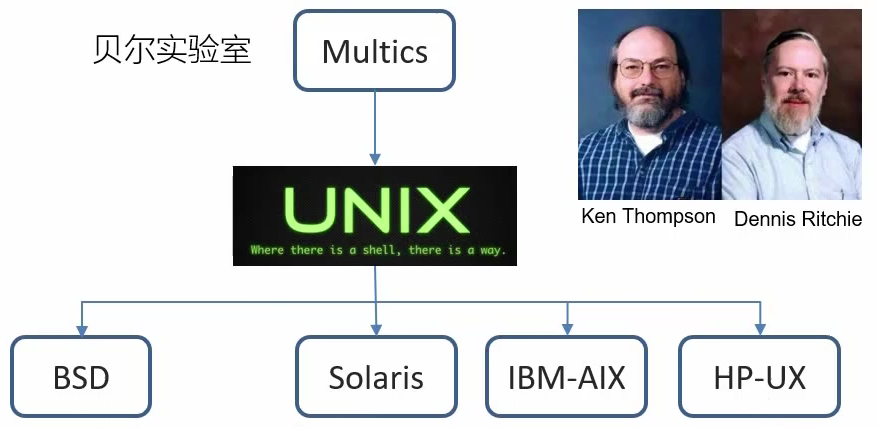
    >
    > 但**集群**发展趋势到来后，Sun/Oracle Solaris逐渐被Oracle Linux替代；
    >
    > 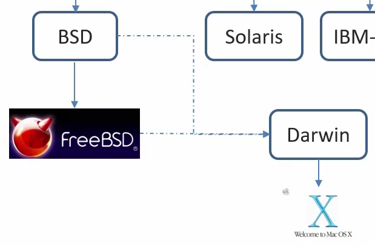
    >
    > 基于BSD，又开发出了FreeBSD
    >
    > > BSD本身就是一个发布协议，方便软件的<u>商业化</u>（允许基于开源开发，再<u>闭源</u>）
    >
    > 基于BSD，又开发出了Darwin，从而有了MacOS的前身

  - 另一位大神（《计算机网络》的作者）参考了Unix的设计，开发出了Minix，并将其<u>开源</u>

  - Linus在使用Minix时觉得其在某些方面有缺陷（比如Minix不能上网），决定自己设计。

    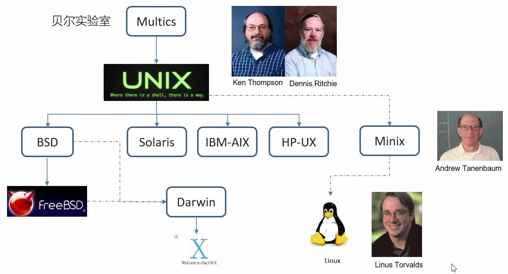

#### 1.3 GNU/Linux

- Richard Stallman，发起<u>自由软件</u>运动，发起GNU计划

- GNU是递归定义的：GNU's Not Unix。
  它计划开发开源高效的操作系统软件，使得用户可以<u>开源</u>地、完整地使用计算机

  > 有Unix优点的操作系统，**短小精悍**，但要开源免费

  > Linux允许多用户操作，具体在VM Ware CentosOS7中，用快捷键`Ctrl Alt F2~6`即可打开多个控制台终端
  
- *GNU Genaral Public Licence*，**GNU 通用公共协议证书**

  - **GPL**

  - <u>自由软件发布</u>的协议

  - 开源，但基于开源的开发必须继续开源

    > BSD协议是允许<u>商业化</u>的，所以苹果公司可以基于FreeBSD开发商业化操作系统MacOS

    > GPL强调的是用户权益，BSD强调软件开发者或者公司的权益

- GNU计划到最后，就差一个操作系统内核了。
  91年的时候，Linux开源，加入GNU，组成 ***GNU/Linux***，标志着GNU计划的完美成功

- 狭义上的Linux，指的是 ***Linux Kernel***
  基于这样的内核，可以开发出各种不同的“外围”。
  这样就形成了各种Linux发行版本，统称为GNU/Linux

- 广义上的Linux，指的就是 ***<u>GNU/Linux</u>***

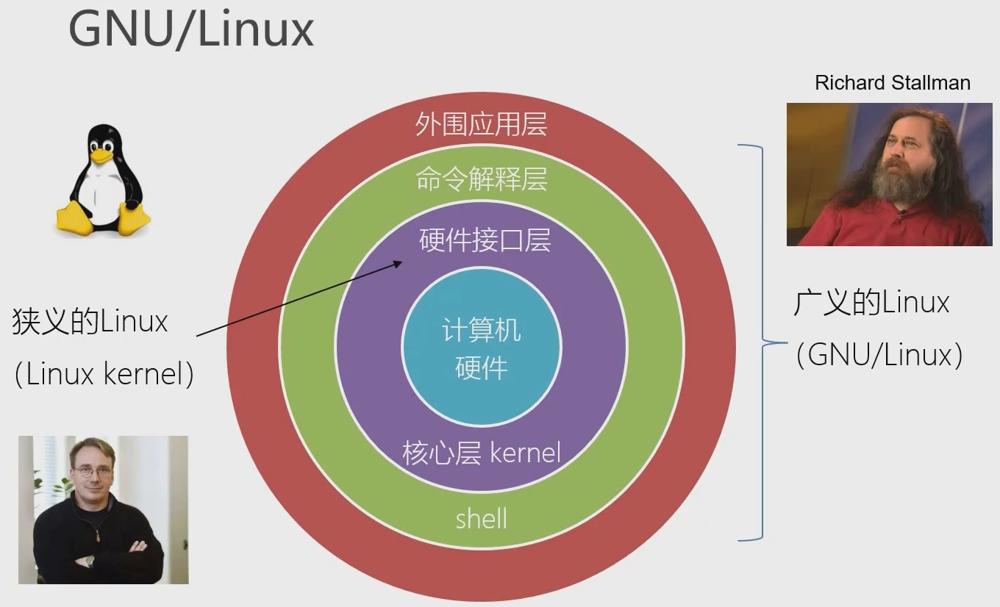

常见的Linux发行版：

- **Red Hat**：追求**高效**而不是界面优美

  - Red Hat Enterprice Linux：企业收费版
  - fedora：社区免费版，实验测试版，可能不够稳定
  - :star:**<u>CentOS</u>**：基于已经发布的企业版，去除版权部分后的<u>社区免费版</u>

- debian：开源系统的典范，十分遵循GNU GPL协议

  - :star2:**<u>ubuntu</u>**：很前沿，可能会有小bug，不稳定；界面优美(偏向MacOS的风格)
    - Linux Mint：基于ubuntu，更像Windows

- SUSE：在欧洲流行，号称最华丽；本身是企业版

  > 桌面环境使用KDE而不是gnome，可能不够稳定，但就是颜值高

  - openSUSE：社区版，基于稳定的SUSE开放出来的

- gentoo linux：性能强悍，但安装十分复杂

- arch linux：轻量级，性能好，但难上手

  - manjaro：友好一些了

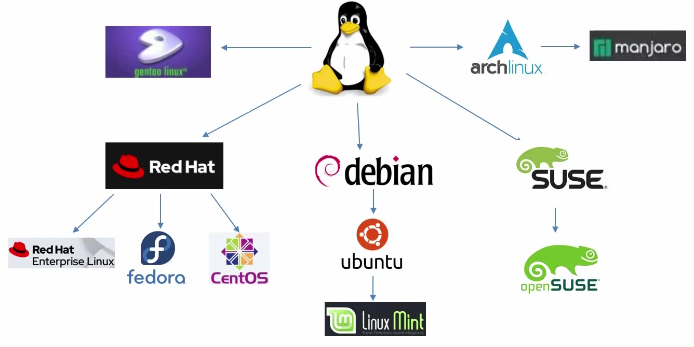

> android、鸿蒙底层内核也是Linux

#### 1.4 Linux VS Windows

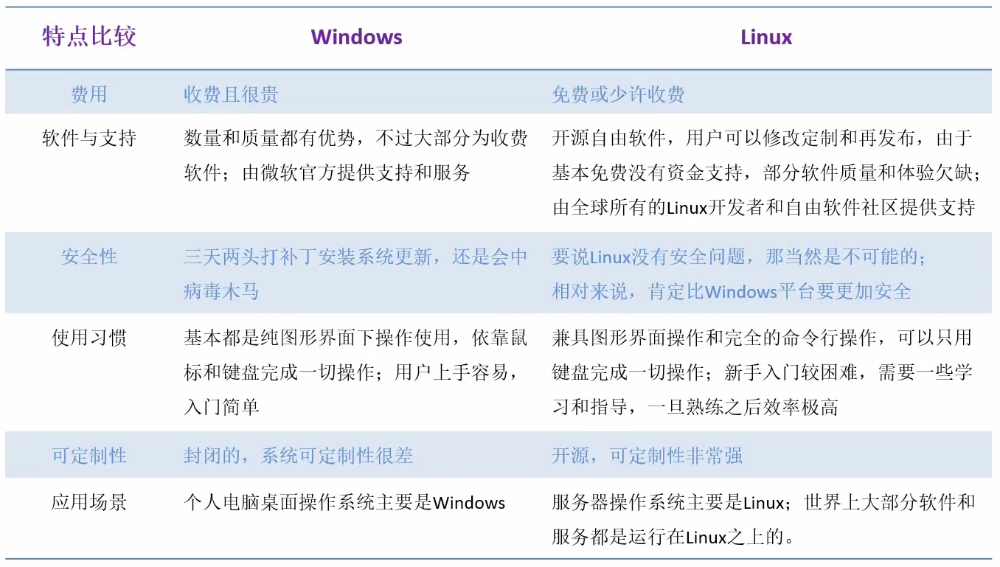

> Linux操作系统的内核可以小到几百kB，非常适合嵌入式开发

> 总结：
>
> - Linux：继承Unix，**短小精悍**，性能强，稳定性安全性好，开源免费
> - Windows：向用户提供各种服务，满足各种生活需求

---

### 2、Linux安装

> 不可能只安装个Linux kernal的，需要安装**Linux发行版**

#### 2.1 CentOS

包管理系统完备：rpm、yum

> ubuntu的包管理系统是apt

可以扩展非常多的软件，技术文档丰富

目前CentOS 8已经不再更新，CentOS 7会更新到2024年，
在这之后可以去用CentOS Stream，但可能不太稳定

> 毕竟Red Hat是商业公司，但这种做法也有点违背开源的初心；
>
> Rocky将来可能会替代老CentOS，做Red Hat Enterprice Linux稳定的社区免费版

#### 2.2 VM Ware

> 操作系统是运行在**硬件**上的，但直接用真实硬件学习起来又不方便；

> Windows环境下有Windows Subsystem for Linux，但限制多

用软件使用硬件并**模拟硬件**，形成**虚拟机**，在其上可以运行<u>操作系统</u>

> 目前比较流行的还有**容器**的方式，比如Docker

#### 2.3 安装过程

1. "DIY硬件”：创建虚拟机

- CPU问题

  - 插槽：一个**主板**上通常有几个**插槽**，就能有几个CPU，也就是**处理器数量**

  - 内核：一个CPU可以有多个独立的**处理核心**，实现并行

  - 逻辑处理器：运用HT(超线程技术)，每个内核又可以扩展成为<u>两个逻辑核心</u>

    > 但配置VM时是不会再扩展<u>逻辑核心</u>的，直接把原PC上的**逻辑核心**当成真正核心。但CPU数量可以配置多个，只要总核心数不超过原电脑逻辑核心数

  > 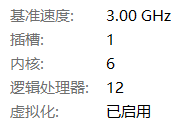
  >
  > 虚拟化也是要启用的，不然虚拟机运行不了（如果没启用，需要进入BIOS中设置）

- 网络类型问题

  - 桥接：把原主机当成桥，去连接其他路由器，在局域网中与原主机地位平等

  - NAT：依托于原主机与外部进行网络连接，把原主机当成**路由器**，对外表现为同一个IP

    > 这样安全性高一些

2. 安装操作系统：

> 主机要支持CPU虚拟化技术VT-X

- 软件选择

  - 最小安装是没有桌面环境的
  - KDE的桌面比较华丽，gnome桌面直观友好
  
- 磁盘分区管理

  - Windows：同一块磁盘，默认有4块分区

    > 为什么没有A、B盘？因为之前是用作软盘的，软盘性能太差了，现在不用

  - Linux：可以只有根分区`/`，如果想有其他分区，需要**<u>挂载</u>**

    > 本质上，Linux只有一个根分区`/`，同时，允许将Linux根分区下的某些文件夹当成新的分区，当然，为了与普通文件夹区分，这些新的分区需要进行“**挂载**”操作
    
    > 一般来说，一定要有一个**引导分区**，挂载点是`/boot`；
    >
    > 还有一个**交换分区**，挂载点是`swap`(没有斜杠)，作为内存的扩展，与内存频繁交换数据；
    >
    > 当然根分区`/`是必须有的
    
    > Linux的磁盘分区管理与目录结构在<u>结构上</u>并不是标准的一对一关系，目录结构更多是**逻辑上的结构**，但可以通过**挂载**与**挂载点**将它们联系起来；
    >
    > 所以常称Linux的目录为==虚拟目录==

- 文件系统

  - xfs：支持大文件，性能优于ext

    > centos7默认选择的是xfs，centos6默认用的就是ext

  - swap：交换分区专用，对内存交换作了优化

    > 内存交换就是将某些硬盘资源当成临时内存，将不常用的内存资源放到硬盘中

---

---

## 基础篇

---

### 1、文件系统与目录结构

#### 1.1 为什么要规范目录

- 防止文件存储过乱

  > 本来就没有可视化界面

- 文件分门别类存储

#### 1.2 目录结构简述

- Linux 只有一个根目录

  > 根目录就是一个`/`

- Linux 会把==硬件映射成目录==去管理

  > 在 Linux 世界中，==**一切皆文件**==；
  >
  > 所谓“挂载”，我觉得也可以理解成是将**硬盘**这种资源映射成了**目录**

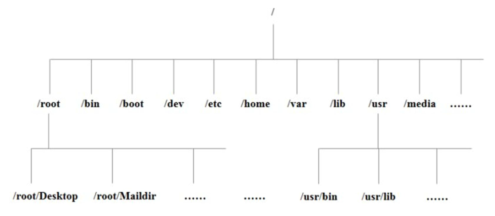

> 这些目录名基于标准定义的，继承了Unix的设计

#### 1.3 具体目录结构介绍

- `/bin`

  - Binary 的缩写

  - 存放经常使用的**命令**

  - 实际上，bin目录中的内容并没有直接存放在`/`目录下，而是存放到了`/usr/bin`中

    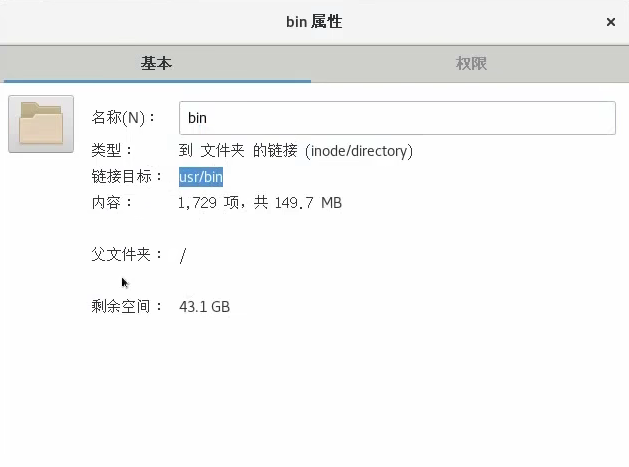

    > `bin`就像一个**超链接**

- `/sbin`

  - s ：super user
  - 存放**系统管理员**使用的系统程序
  - 同样也是一个链接，实际链接到`/usr/sbin`

- `/lib`

  - 系统运行所需要的最基本的**动态连接共享库**

    > 类似于 Windows 的 system32 目录，存放 DLL 文件

    > 几乎所有应用程序都需要用到这些共享库
    
  - 本质也是一个**链接**，链接到`/usr/lib`

- `/lib64`

  - 与`/lib`类似，也是存放**库文件**，只不过是64位操作系统相关的
  - 本质也是一个链接，链接到`/usr/lib64`

- `/usr`

  - 用户**安装**的<u>应用程序</u>、<u>用户相关数据文件</u>等默认存放的目录

    > 类似 Windows C:/program files

  - 也存放了**系统**运行需要的<u>命令文件</u>和<u>库文件</u>

    > 类似 Windows C:/system32

- `/usr/local`

  - 另一个给主机额外**安装程序**所存放的目录

    > 一般是通过编译源码方式安装的程序，相当于用户自己的扩展；
    >
    > 其下也有对应的那4个重要目录：`/bin /sbin /lib /lib64`

- `/boot`

  - Linux **启动**需要的核心文件

  - 是<u>引导分区</u>的**挂载点**

    > 默认情况下，除了这个`/boot`，其他都在根分区`/`下（`swap`交换分区除外）

- `/dev`

  - devices

  - 存储所有**硬件**的文件形式

    > 类似 Windows 的**设备**管理器

- `/etc`

  - 所有系统管理所需要的**配置文件**及其子目录

    > 比如 mysql 配置文件 my.conf

- `/home`

  - “存放”**普通用户**的目录

    > 每个普通用户都对应一个目录，相当于把普通用户也映射成文件了

- `/root`

  - **系统管理员**目录

    > 将系统管理员映射成文件

- `/opt`

  - 给主机额外**安装第三方软件**所存放的目录，默认为空（所以是optional，可选的）

    > 比如 Oracle、MySQL

- `/media`

  - 挂载 linux 系统自动识别的一些**可移动设备**

    > 例如 U 盘、光驱

  - **移动化存储设备**的挂载点之一

- `/mnt`

  - 为了让用户临时挂载别的文件系统
  - 可以将**外部的存储**挂载到`/mnt/`中，然后进入该目录就可以查看
  - **移动化存储设备**的挂载点之一

- `/proc`

  - process，进程目录

  - 虚拟的目录，是系统内存中<u>进程的映射</u>

    > 可以访问这个目录来获取**系统信息**

- `/run`

  - 运行目录，存放系统本次<u>运行</u>的<u>实时信息</u>
  - 临时的文件目录，重启后就刷新

- `/srv`

  - service，系统服务相关
  - 服务启动之后需要提取的数据

- `/sys`

  - 系统**硬件**相关信息文件
  - 安装了 linux2.6 内核中新出现的文件系统

  > `/proc`、`/srv`、`/sys` 别动它们；
  >
  > 我们可以动的：tmp、opt、home(或者root)、var、etc、media、mount
  >
  > > 当然也要谨慎修改

- `/tmp`

  - 存放一些**临时**文件

    > 没空间了可以删除其中的文件

- `/var`

  - 可变目录

  - 存放<u>不断扩充</u>着的东西、经常被<u>修改</u>的目录

    > 比如日志相关

- `/lost+found`

  - 一般是空的。系统**非法关机**后会存放一些文件
  - 默认隐藏的，需要 root 用户在终端查看

- `/selinux`

  - 安全子系统

  - 控制程序只能访问特定文件

    > 有三种工作模式，可以自行设置

---

### 2、VI/VIM编辑器

#### 2.1 vi/vim概述

- VI 是 Unix 操作系统和类 Unix 操作系统中最通用的文本编辑器。
- VIM 编辑器是从 VI 发展出来的一个性能更强大的文本编辑器。可以主动地以字体颜色辨别语法的正确性，方便程序设计。VIM 与 VI 编辑器完全兼容。

#### 2.2 模式间转换

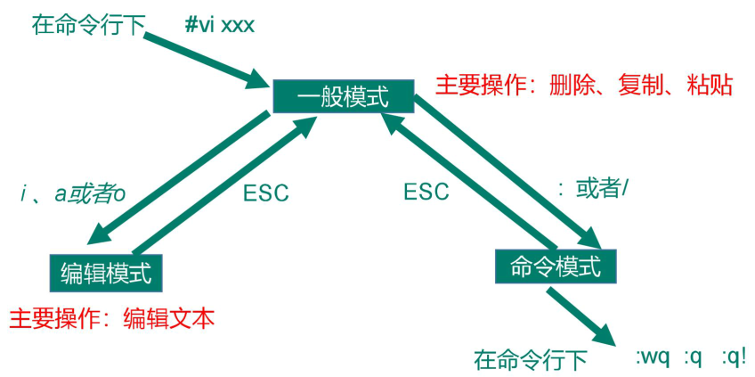

#### 2.3 一般模式

​	以 vim 打开一个档案就<u>直接进入一般模式</u>了（这是默认的模式）。在这个模式中， 你可以使用『上下左右』按键来移动光标，你可以使用『**删除**字符』或『**删除**整行』来处理档案内容， 也可以使用『**复制**、**粘贴**』来处理你的文件数据。

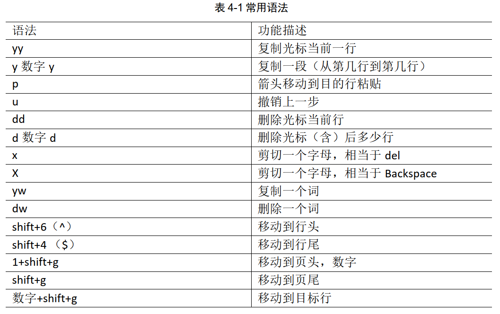

> 补充：
>
> - w：移动光标到下一个单词
> - 数字+shift+g是快速移动到某一行
> - gg：移动的文档开关
> - L：跳转到窗口显示的最后一行
> - r：下一个输入的字符会替换当前字符
> - R：进入连续替换模式

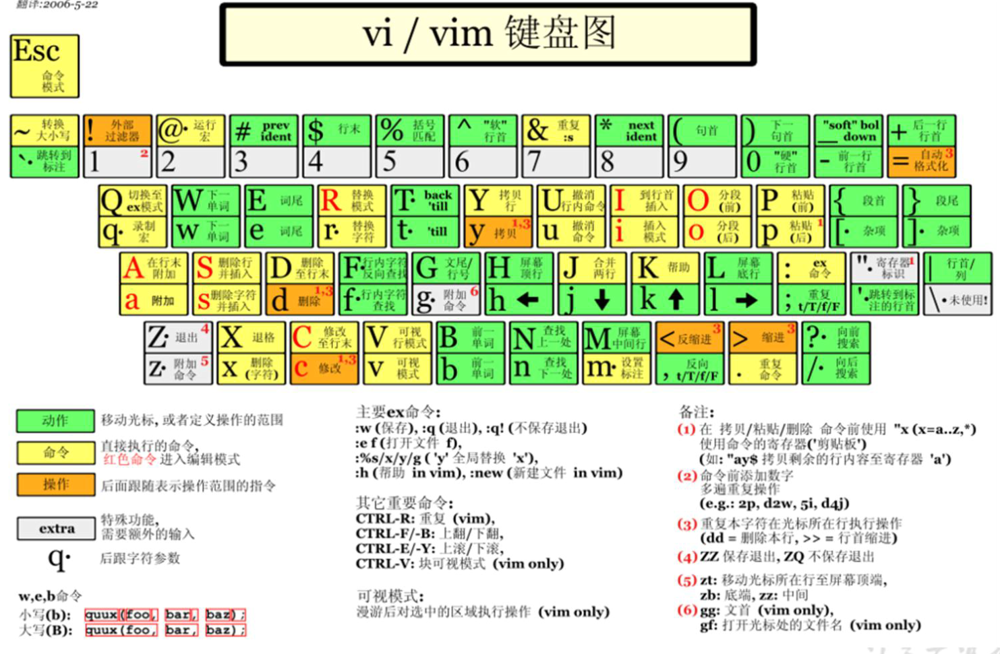

#### 2.4 编辑模式

​	在一般模式中可以进行删除、复制、粘贴等的动作，但是却无法直接编辑文件内容的！要等到你按下『i, I, o, O, a, A』等任何一个字母之后才会进入编辑模式。

​	注意了！通常在Linux中，按下这些按键时，在画面的左下方会出现『INSERT或REPLACE』的字样，此时才可以进行编辑。而如果要回到一般模式时， 则必须要按下『Esc』这个按键即可退出编辑模式。

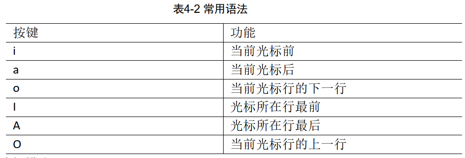

> o/O是会额外插入一行的

#### 2.5 命令模式

​	在一般模式当中，输入『 : / ?』3个中的任何一个按钮，就可以将光标移动到最底下那一行。

​	在这个模式当中， 可以提供你『搜寻资料』的动作，而读取、存盘、大量取代字符、离开 vi 、显示行号等动作是在此模式中达成的！

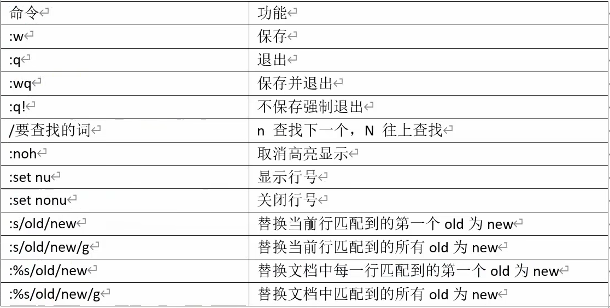

> 补充：
>
> - `wq!`常用于对<u>只读文件</u>进行必要修改
>
> - `:noh`在`/查找`后取消高亮
>
>   > h：highlight
>
> - 关于`/查找`，按n向下，按N向上
>
> - 关于替换操作
>
>   - `s`：substitute
>   - 可以加`c`参数，让每次替换都询问

---

### 3、网络配置和系统管理操作

#### 3.1 查看网络IP和网关

关于自己主机的网络与IP：

- 通过“网络和Internet设置”、“高级网络设置”、“更改适配器选项”进入网络连接界面

  > VMware开头的那两个是VMware自己弄的，这个之后再说
  >
  > 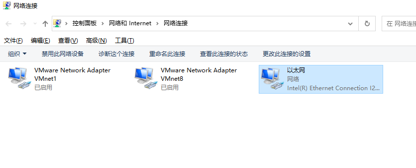

- 右击，选择“状态”，才能看到自动获取的IP地址，这是内网IP

- 百度搜索“IP地址查询”又可以看到一个不同的IP地址，这个其实是网络服务商分配给我们的，路由器对应的IP，是外网IP

- `ipconfig`查看本机网络配置相关信息，一般要看的是“以太网适配器 以太网”

- 用虚拟机`ping`主机的内网IP，能`ping`通说明虚拟机可以接收到主机的数据

查看虚拟机IP：

- 图形界面内，设置，网络
- `ifconfig`命令
  - interface config：(网络)接口配置

> 现在有两个疑问：
>
> - 为什么VMware也弄了两个网络适配器/网卡？
>
>   > 这其实对应着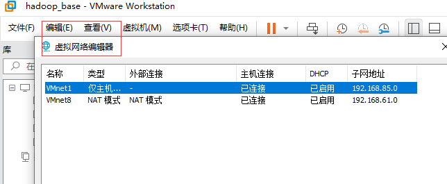
>   >
>   > 点击“更改设置”后还可以看见一个VMnet0，是桥接模式要用的，下面会讲
>   >
>   > 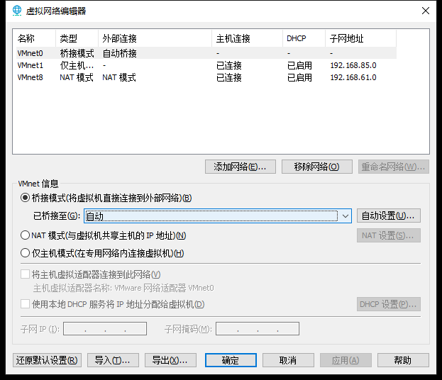
>
> - 就算主机和虚拟机的IPv4地址类别不同，不在同一个网段内，也可以互相`ping`通，为什么？
>
> 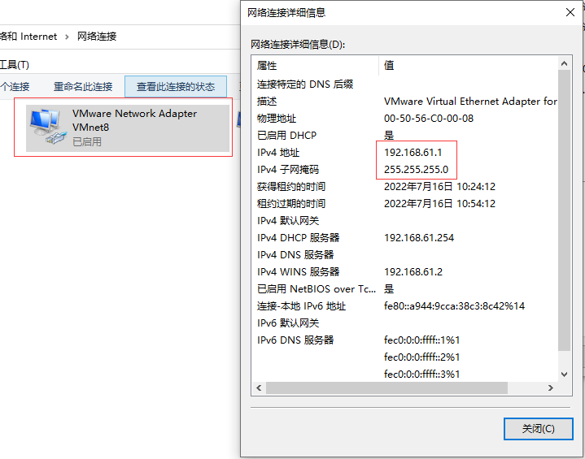
>
> 发现主机中VMnet8网卡的IP与虚拟机的IP相同

VMWare提供了三种网络连接模式：

- 桥接模式

  虚拟机直接连接外部物理网络的模式，主机起到了网桥的作用。这种模式下，虚拟机**可以直接访问外部网络**，并且**对外部网络是可见的**

  > 虚拟机和主机要配置在**同一个网段下**，子网掩码、DNS服务器也要相同

  > 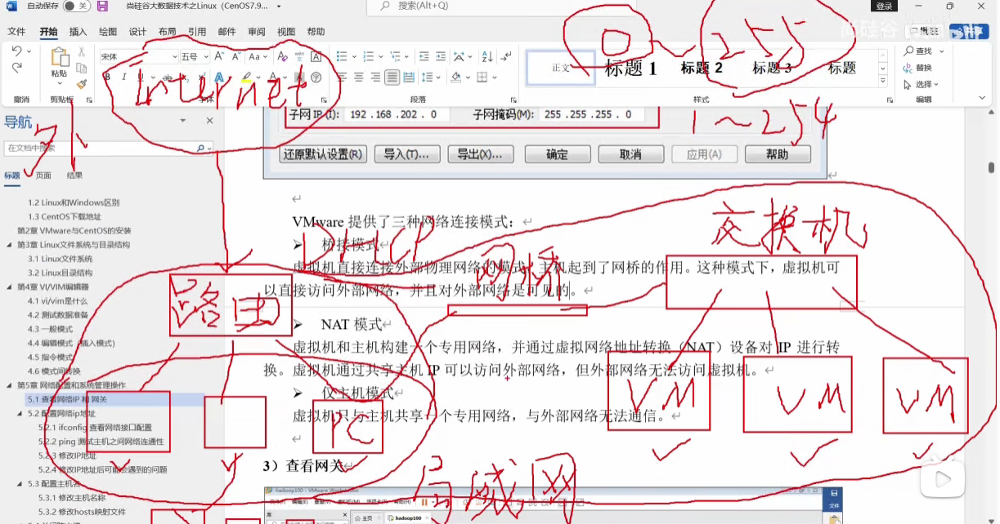
  >
  > 一个桥的一边不能连太多设备，所以VM那边还用到了**交换机**；
  >
  > 主机和VM都在同一个局域网下，是**平等的**，也要占用IP，所以实际应用比较少

- NAT模式（Network Address Transition）

  虚拟机和主机构建一个专用网络，并通过虚拟网络地址转换（NAT）设备对IP进行转换。虚拟机通过**共享主机IP**可以访问外部网络，但外部网络无法访问虚拟机

  > 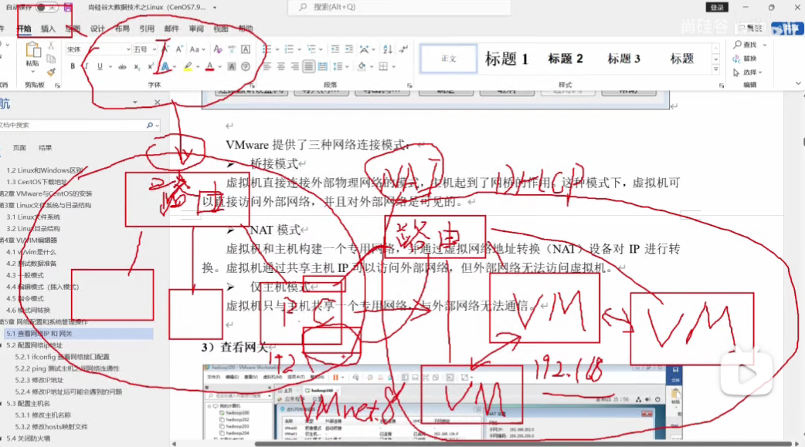
  >
  > VMware在底层创建了NAT和DHCP服务器，相当于虚拟的路由器，与主机网卡相连，做动态地址分配。这就形成了**两个不同的局域网**。
  >
  > 通过虚拟路由，VM可以访问主机，再通过路由器，进而访问外网；但为了让主机访问虚拟机，就需要在主机那边再虚拟一个网卡出来（这就是VMware做的事，那个*VMnet8*），接到虚拟子网的路由器上

- 仅主机模式

  虚拟机只与主机共享一个专用网络，**与外部网络无法通信**

  > 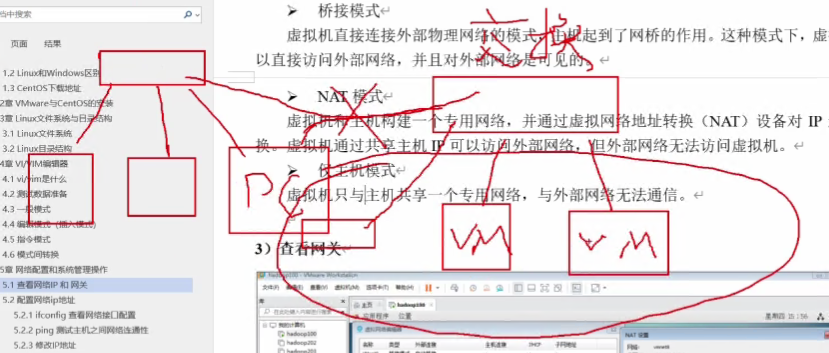
  >
  > VM那边就用一个**交换机**，也没有虚拟路由了

> 思考：为什么虚拟机NAT的网关是.2，虚拟网卡是.1呢？
>
> 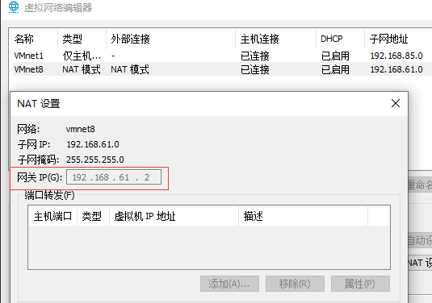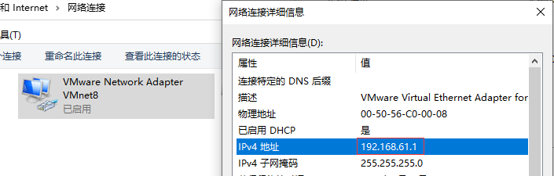
>
> 虚拟出来的网卡与VM其实是平等的，都接到**虚拟路由**上，所以真正的网关应该设置为虚拟路由

#### 3.2 配置网络IP地址

> 目前在默认情况下已经可以正常上网了，那还存在什么问题？
>
> 当前有DHCP服务器，IP都是**动态分配**的，服务器重启之后IP可能都变了，所以还是希望把服务器IP设定为不变的，也就是设置一个**静态IP地址**

设置windows主机网卡的静态IP：

- “网络和Internet设置”、“更改适配器选项”、“网卡-属性”、“Internet协议版本4”

  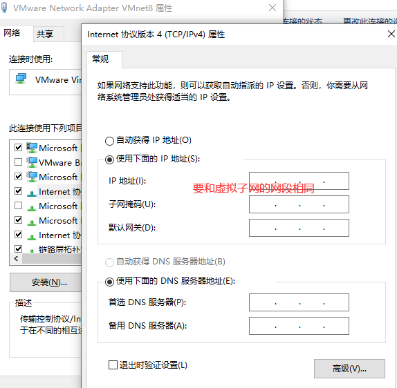

  > 当然设置这个意义不大，虚拟机想连接主机的时候，也就是想连接外部网络的时候，直接用虚拟路由作NAT地址转换直接获取即可；
  >
  > 一般是主机去操控虚拟机，所以重点是设置好虚拟机的IP
  >
  > > 主机$\overset{访问}{\rarr}$虚拟机这个方向往往需要一些特殊配置

**<u>设置Linux虚拟机的静态IP</u>**：

- 当然，通过VMware可以直接修改**NAT子网的IP地址**，改了之后对应网关、主机虚拟网卡（可以自动获取）、虚拟机IP等等都要跟着修改

  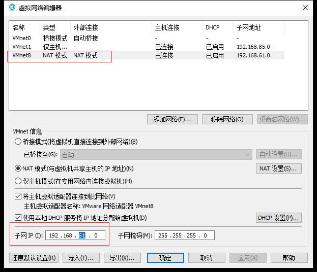

  > 一般没必要改这个，这个不是重点

- 图形化界面：【设置】【网络】【IPv4】【手动】

- Linux终端控制台：

  - 配置文件在哪？`/etc/sysconfig/network-scripts/`目录下，`ifcfg-ens33`

    > 这个`ens33`在使用`ifconfig`命令的时候就可以查看到

  - 修改`BOOTPROTO="dhcp"`为`BOOTPROTO="static"`

  - 加入配置项

    - IP地址：`IPADDR=192.168.61.200`

      > 这里使用61是因为NAT分配到的子网IP就是61，使用200是因为之前学k8s的时候100已经被占了（这台机器叫`hadoop100`本意还是想分配100给它的）

    - 网关：`GATEWAY=192.168.61.2`

    - 域名解析器：`DNS1=192.168.61.2`

      > 这里是DNS1，也就是可以有多个域名解析器，这里直接选虚拟路由就可以

    > 为什么没有子网掩码？因为C类地址默认给的就是`255.255.255.0`，不用特意设置了

  - 重启网络服务：`service network restart`

修改IP地址后可能会遇到的问题：

- 物理机能 `ping `通虚拟机，但是虚拟机 `ping `不通物理机，一般都是因为物理机的**防火墙**问题，把防火墙关闭就行

- 虚拟机能 `ping `通物理机,但是虚拟机 `ping `不通外网,一般都是因为 **DNS** 的设置有问题 

- 虚拟机 `ping www.baidu.com `显示域**名未知**等信息,一般查看 **GATEWAY** 和 **DNS** 设置是否正确 

  > **子网**和**网关**保持一致

- 如果以上全部设置完还是不行，需要关闭 NetworkManager 服务

  > 其实更推荐去关闭centos6的network服务，然后重启centos7的NetworkManager服务
  >
  > `systemctl stop network` `systemctl restart NetworkManager`
  >
  > （有关服务的问题学到后面就明白了）

  - systemctl stop NetworkManager 关闭 
  - systemctl disable NetworkManager 禁用 

- 如果检查发现 `systemctl status network` 有问题 需要检查ifcfg-ens33

#### 3.3 配置主机名

查看虚拟机主机名：

- `hostname`

更改虚拟机主机名：

- 配置文件在：`/etc/hostname`

- 让配置生效

  - 方法一：重启服务器能

  - **<u>方法二</u>**：`hostnamectl set-hostname new_hostname`

    > 这种方法可以实时生效，配置文件也会跟着自动修改

    > 单独的`hostnamectl`命令可以查看主机名和系统相关信息

设置hosts文件：

> 相当于通讯录

- 配置文件在：`/etc/hosts`

- 配置的格式是：`IP地址 主机名`

- windows的hosts文件在：`C:\Windows\System32\drivers\etc\hosts`

  > 如果不能直接修改，就先另存为，再替换（这时会自动用到管理员权限）

- 这样以后，`ping 主机名`即可

  > hosts文件中当然也可以配置IP地址与域名的映射关系。
  >
  > 有一种网络攻击方式就是**域名劫持**，更改hosts文件。

#### 3.4 远程操控与文件传输

为什么要远程登录：

- Linux 服务器由开发小组共享
- Linux 系统一般在**公网**上

> Linux支持多用户操作

怎么远程登录：

- 最经典与最简单的登录方式：基于SSH(Secure SHell)协议的方式
  - 登录命令：`ssh 用户名@IP地址/主机名`
  - 退出命令：`exit`
- XShell：Linux终端模拟软件，远程登录工具

怎么上传和下载文件：

- `scp`命令

  - secure copy， linux 系统下基于ssh登陆进行安全的远程文件拷贝命令。

    > scp 是加密的，rcp 是不加密的，scp 是 rcp 的加强版。

  - 用法汇总：

    ```
    scp 本地或远程文件的路径 服务器用户名@服务器地址:远程或本地文件的路径
    -1： 强制scp命令使用协议ssh1
    -2： 强制scp命令使用协议ssh2
    -4： 强制scp命令只使用IPv4寻址
    -6： 强制scp命令只使用IPv6寻址
    -B： 使用批处理模式（传输过程中不询问传输口令或短语）
    -C： 允许压缩。（将-C标志传递给ssh，从而打开压缩功能）
    -p：保留原文件的修改时间，访问时间和访问权限。
    -q： 不显示传输进度条。
    -r： 递归复制整个目录。
    -v：详细方式显示输出。scp和ssh(1)会显示出整个过程的调试信息。这些信息用于调试连接，验证和配置问题。
    -c cipher： 以cipher将数据传输进行加密，这个选项将直接传递给ssh。
    -F ssh_config： 指定一个替代的ssh配置文件，此参数直接传递给ssh。
    -i identity_file： 从指定文件中读取传输时使用的密钥文件，此参数直接传递给ssh。
    -l limit： 限定用户所能使用的带宽，以Kbit/s为单位。
    -o ssh_option： 如果习惯于使用ssh_config(5)中的参数传递方式，
    -P port：注意是大写的P, port是指定数据传输用到的端口号
    -S program： 指定加密传输时所使用的程序。此程序必须能够理解ssh(1)的选项。
    ```

  - 具体用法：

    - 从**本地**将**文件**传输到**服务器**

      `scp 本地文件的路径 服务器用户名@服务器地址:服务器上存放文件的路径`

      `scp /Users/mac_pc/Desktop/test.png root@192.168.1.1:/root`

    - 从**本地**将**文件夹**传输到**服务器**

      `scp -r 本地文件夹的路径 服务器用户名@服务器地址:服务器上存放文件的路径`

      `scp -r /Users/mac_pc/Desktop/test root@192.168.1.1:/root`

    - 将**服务器**上的**文件**传输到**本地**

      `scp 服务器用户名@服务器地址:服务器上存放文件的路径 本地文件的路径`

      `scp root@192.168.1.1:/data/wwwroot/default/111.png /Users/mac_pc/Desktop`

    - 将**服务器**上的**文件夹**传输到**本地**

      `scp -r 服务器用户名@服务器地址:服务器上存放文件的路径 本地文件的路径`

      `scp -r root@192.168.1.1:/data/wwwroot/default/test /Users/mac_pc/Desktop`

    

- xftp软件：能完成 XShell 完成不了的文件传输功能

  > 使用的是SFTP协议

- 注意选择`/opt`目录

---

### 4、系统管理

>Linux中的进程和服务：
>
>- 计算机中，一个正在执行的**程序或命令**，被叫做“进程”（process）。
>
>  > 进程要占用资源，操作系统会给每一个进程分配一个PID
>
>- 启动之后一直存在、**常驻内存的进程**，一般被称作“服务”（service）。
>
>  > 网络服务就是一种服务，大部分服务都是在后台运行的；
>  >
>  > 与之对比，在终端输入的许多命令，大部分都是输入执行之后很快可以返回结果并结束的
>
>  > windows中查询服务：【右击此电脑】【管理】【服务和应用程序】
>
>- **系统服务**：操作系统运行时需要很多后台服务的支撑，这些服务往往随着系统的引导装入而启动，直到系统关闭才会终止，这类服务统称为系统服务
>
>  > 具体执行系统服务的进程往往称为**守护进程**（daemon），服务名以`d`结尾的服务往往就是守护进程运行的系统服务

#### 4.1 service服务管理

centos6方式：（了解即可）

- 基本语法：
  
- `service 服务名 start|stop|restart|status`
  
- 服务目录：
  - `/etc/init.d`

  > 在centos7中这样查看服务的话，只能看到很少的服务，其实是 SysV 服务，其中有`network`，这几个服务用centos6和centos7方式调用都可以；
  >
  > 当然，centos7提供了**network的替代服务**，也就是`NetworkManager`

:star:centos7方式：

- 基本语法：

  - `systemctl start|stop|restart|status 服务名`

- 服务目录：

  - `/usr/lib/systemd/`

    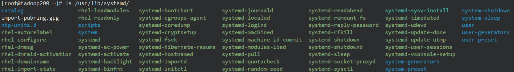

    > systemd不只自己是一个服务，它还是一个大家族，原生systemd服务

  - 在`/usr/lib/systemd/system`下还有大量服务

    > `xxx.service`就是**服务文件**，`xxx.target`可以理解为**一组服务的集合**

#### 4.2 系统运行级别

Linux 运行级别[CentOS 6]：

- 启动过程：

  

  > 主动启动的第一个进程就是`init进程`，然后该进程根据**系统运行级别**，启动对应运行级别下支持的服务

- 运行级别：

  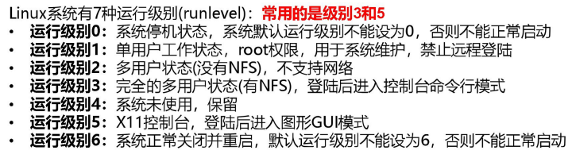

  > 运行级别1是很**安全**的，只能操作实体机器，单用户
  >
  > > 相当于windows系统的**安全模式**
  >
  > 运行级别2允许多个用户登录，但没有**网络**文件系统（NFS）
  >
  > 运行级别3就相当于是“完全体”了，很常用
  >
  > > 3断了网络文件系统就和2差不多了
  >
  > 运行级别5就是有图形化界面的样子了
  >
  > 运行级别0和6就很奇怪，系统都启动不了，当然也几乎不用；运行级别4也几乎用不到

  >查看默认级别：`vi /etc/inittal`

Linux 运行级别[CentOS 7]：

>发现centos6中，绝大多数情况下能用到的运行级别就只有3和5

- `multi-user.target` 等价于原运行级别 3（多用户有网，无图形界面）

- `graphical.target` 等价于原运行级别 5（多用户有网，有图形界面）

- 查看当前运行级别：`systemctl get-default`

- 修改当前运行级别：`systemctl set-default TARGET.target`

  这里 `TARGET `取 `multi-user` 或者 `graphical`

  > 同样是需要重启才能生效

  > 在VMware中用快捷键Ctrl Alt F2~F6就相当于修改运行级别为3了

  > 其实有更简洁的命令：`init 3`和`init 5`

#### 4.3 service自启动配置

在centos图形界面中配置：

- 在终端输入`setup`命令，可以进入系统服务相关的图形界面
- 进入后按回车选择【系统服务】，之后按【空格】可以设置服务的开机自启
- 按【tab】可以去到退出

在终端命令行中配置：

- centos6查看自启动服务：`chkconfig --list`

  ```c
  [root@hadoop200 ~]# chkconfig --list
  
  注：该输出结果只显示 SysV 服务，并不包含
  原生 systemd 服务。SysV 配置数据
  可能被原生 systemd 配置覆盖。 
  
        要列出 systemd 服务，请执行 'systemctl list-unit-files'。
        查看在具体 target 启用的服务请执行
        'systemctl list-dependencies [target]'。
  
  netconsole     	0:关	1:关	2:关	3:关	4:关	5:关	6:关
  network        	0:关	1:关	2:开	3:开	4:开	5:开	6:关
  ```

  > 对于network服务，设置了开机自启动就是在2、3、4、5级别下开着，0、1、6没必要开

- centos6开关自启动服务：`chkconfig 服务名 on|off`

  - 开关对应级别：`chkconfig --level 级别 服务名 on|off`

- :star:centos7查看所有服务的自启动状态：`systemctl list-unit-files`

  > unit：在systemd管理模式下，所有服务都是一个unit，一个管理单元

- :star:centos7查看某个服务的自启动状态：`systemctl status 服务名`

  > `loaded`后面括号中的`enalbed`或`disabled`就代表了是否开机自启动，`vendor preset`是默认的配置情况

- :star:centos7开关某个服务的自启动：`systemctl enable|disable 服务名`

  > 按Ctrl C可以切出去

> 尝试开关**防火墙服务**：
>
> - centos6及之前叫iptables
>
>   > 防火墙本质就是一张ip:port是否放行的表
>
> - centos7叫firewalld

#### 4.4 关机重启命令

Linux操作系统大多用于服务器，很少会有关机操作，不得以才会关机重启。

关机：

- `shutdown`系列：

  - `shutdown`：一分钟后关机

    > 为什么默认要等一分钟？
    >
    > :star:因为在关机之前会有一个`sync`操作，要将数据<u>由内存**同步**到硬盘</u>中
    >
    > > Linux为了提高磁盘的读写效率，设置了**预读**和**延迟写入**的方式
    > >
    > > > 读的时候先读，写的时候后写，通过**缓冲区**来实现
    >
    > 其实就算是`shutdown now`也会先**同步**再关机

  - `shutdown -c`：取消关机

  - `shutdown now`：立刻关机

  - `shutdown number`：number分钟后关机

  - `shutdown hour:minute`：在今天hour:minute时关机

- `sync`：将数据由内存同步到硬盘中

- `halt`：停机，关闭系统，但不断电

  > 停机不是关机，是cpu基本上停止工作了，但内存中的数据还可以保持。
  >
  > 在自己虚拟机上运行这条指令后，只能接着关机了，不能恢复回原来开机的状态

- `poweroff`：关机，断电

重启：

- `reboot`：重启，等同于`shutdown -r now`

> 总得来说，所有关机重启相关命令都可以使用<u>`shutdown`系列</u>来实现，shutdown相关选项如下：
>
> 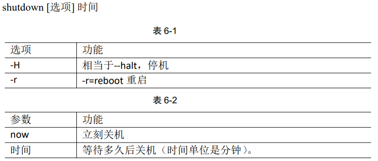
>
> > 补充：
> >
> > - -h	关机
> > - -P    关机

---

---

## 实操篇

---

本篇主要讲的是**常用基本命令**。

Shell 可以看作是一个命令解释器，为我们提供了**交互式**的文本控制台界面。我们可以通过终端控制台来输入命令，由 shell 进行解释并最终交给**内核**执行。本章就将分类介绍常用的基本 shell 命令。

> bin下面会有一个sh命令，可以理解为 Shell 的入口；
>
> 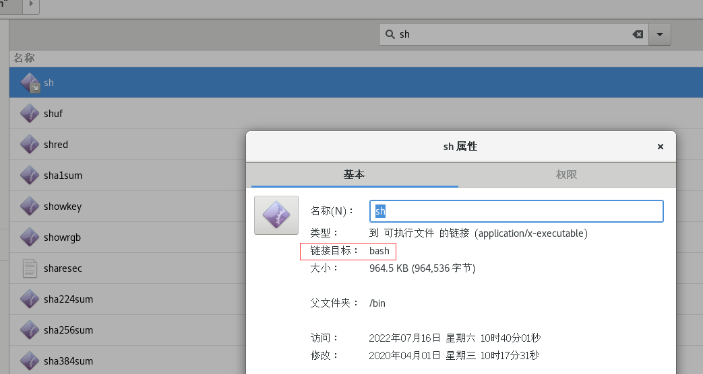
>
> Shell 的实现也可以有很多种，当前大多数Linux发行版使用的shell就是Bourne Agian SHell，也就是***bash***，bash shell，但也不是所有的都用bash，比如ubuntu（基于Debian）用的就是***dash***，常见的还有csh；
>
> 可以在命令行中通过`ls -l /bin/ | grep sh`来查看相关命令

### 0、帮助命令

Linux为我们提供了一个**命令手册**，当我们遇到陌生的命令时可以直接查找。

基本语法：

- `man 命令或配置文件`：获得命令相关帮助信息

  > manual 手册

  > 使用`man cd`查看时，发现得到的是bash命令相关信息，这是因为cd是shell的**内置命令**，不同于ls等**外部命令**

- `man -f 命令`：获得记载在手册中的所有和该命令相关的解释

  >也就是说某些命令会被记录在手册中的多处位置，因为命令手册很庞大，是**分册**管理的。
  >
  >```c
  >[root@hadoop200 ~]# man -f cd
  >cd (1)               - GNU Bourne-Again SHell (GNU 命令解释程序 “Bourne二世”)
  >cd (3tcl)            - 改变工作目录
  >cd (1p)              - change the working directory
  >```
  >
  >p：posix，基于unix的可移植性操作系统的开发规范（IEEE中的）
  >
  >3ctl：就是第3册的意思

- `man 分册名 命令`：获得对应分册下命令的解释

内置命令：

- 一部分基础功能的系统命令是直接**内嵌在 shell 中**的，系统加载启动之后会随着shell 一起加载，**常驻系统内存中**。这部分命令被称为“内置（built-in）命令”；相应的其它命令被称为“外部命令”。

  > 如何判断是内嵌命令还是外部命令？`type 命令名`

  > 常见内置命令：`cd exit history type`

- `help 命令`：获得 shell **内置命令**的帮助信息

  > 对于**外部命令**，可以用`命令 --help`来达到类似的效果

> 补充：常用快捷键
>
> 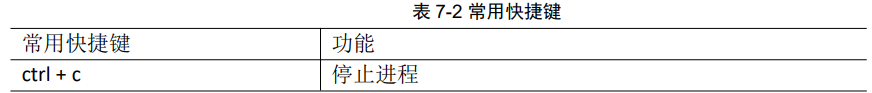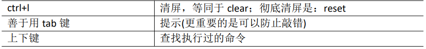

### 1、文件目录类

#### 1.1 pwd

pwd：print working directory

功能描述：显示当前工作目录的绝对路径

基本语法：`pwd`

> 可以加`-P`选项，无视**软链接**的影响，查看原绝对路径（后面学到软链接就明白了）
>
> ```c
> [root@hadoop200 bin]# pwd
> /bin
> [root@hadoop200 bin]# pwd -P
> /usr/bin
> ```

#### 1.2 ls

ls：list 

功能描述：列出目录内容

基本语法：`ls [选项] [目录或文件]`

选项说明：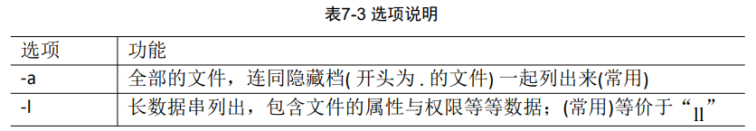

> 注：
>
> - 以`.`开头的文件(夹)都是隐藏文件(夹)，通过`ls -a`可以查看到
>
>   > 比如`.bashrc`，就是当前用户很重要的配置文件
>
> - 如何区分`ls`出来的是文件还是文件夹？
>
>   - 当然，可以看颜色
>
>     ```c
>     [root@hadoop200 ~]# type ls
>     ls 是 `ls --color=auto' 的别名  
>     ```
>
>   - 如果颜色无法区分的话，就可以用`ls -l`查看，如果以`-`开头就是文件，以`d`开头就是文件夹
>
> - `ll`就相当于`ls -l`
>
> - `ls -al`就是将这两个选项合并到一起用了

#### 1.3 cd

cd：Change Directory

功能描述：切换路径

基本语法：`cd [参数]`

参数说明：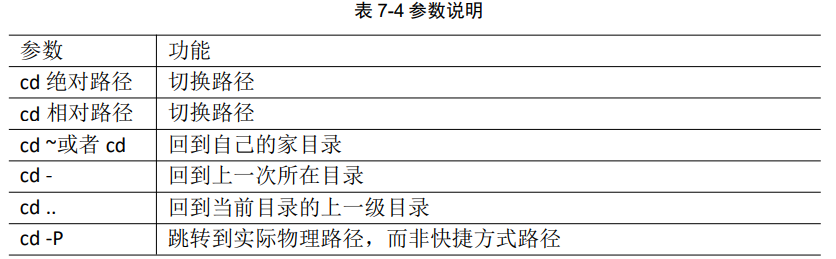

> 说明：
>
> - 用`cd -`可以实现两个路径之间来回切换
> - 这个`-P`参数也是无视软链接的影响，学到后面软链接就知道了

> Linux中**绝对路径**与**相关路径**的区别
>
> - 绝对路径以`/`开头，相对路由不以`/`开头	

#### 1.4 mkdir

mkdir：Make directory

基本功能描述：建立目录

语法：`mkdir [选项] 要创建的目录`

选项说明：

> 注：
>
> - `mkdir 目录1 目录2 目录3 ...`可以一次创建多个目录
>
> - **嵌套创建目录**需要加`-p`，`p：parent`
>
>   > 嵌套时不加`-p`的话，会将前面的目录当成**已经存在的目录**去寻找，然后再创建单层目录

#### 1.5 rmdir

rmdir：Remove directory

功能描述：移除目录

基本语法：`rmdir 要删除的空目录`

> 注：
>
> - `rmdir`也有`-p`选项，这并不是直接删除文件夹，而是先尝试删除最里层的文件夹，**如果是空的则删除成功**，继续尝试删除外层的文件夹，直到删除失败或全部删除完
>
>   > 如果是中途删除失败，仍然会删除之前已经成功删除的文件夹；
>   >
>   > 注意要**把目录的路径写全**，而不只是一个最外层目录名
>
> - `rm -rf 要删除的目录或文件`可以强制删除嵌套文件夹，但一般不建议使用

#### 1.6 touch

功能描述：创建空文件

基本语法：`touch 新文件名称`

> 注：
>
> - 也可以`touch`已经存在的文件，但没什么效果
> - 新文件名称前也可以跟着已经存在的路径

#### 1.7 cp

cp：copy

功能描述：复制source文件到dest

基本语法：`cp [选项] source dest`

选项说明：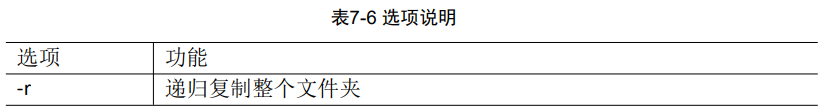

> 注：
>
> - `source`可以是一个目录，此时最好加上`-r`选项，不然没什么意义

参数说明：

> 注：
>
> - `dest`可以是目录也可以是文件，如果`dest`是目录，则直接复制过去，如果目标目录下已经有同名文件了，则会询问“是否覆盖”；如果`dest`是文件，则会询问“是否覆盖”
>
>   > 将`cp`改成`\cp`就不会询问“是否覆盖”了，而是直接覆盖
>   >
>   > > 注意这是**反斜杠**，代表直接使用**原生命令**
>   > >
>   > > ```c
>   > > [root@hadoop200 ~]# type cp
>   > > cp 是 `cp -i' 的别名
>   > >     
>   > > -i, --interactive     prompt before overwrite
>   > > ```
>   > >
>   > > 同理，如果使用`\ls`，则也不会有颜色区分文件和文件夹了
>   > >
>   > > 那么有多少是别名的命令呢？使用`alias`命令查看

#### 1.8 rm

rm：remove

功能描述：递归删除目录中所有内容

基本语法：`rm [选项] deleteFile`

选项说明：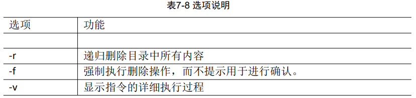

> 注：
>
> - 用`rm`删除目录时必须加`-r`，不然就算是空目录也删除不了，如果只加`-r`不加`-f`，会有多级提示
>
>   ```c
>   [root@hadoop200 ~]# rm -r a
>   rm：是否进入目录"a"? y
>   rm：是否删除普通空文件 "a/atest.txt"？y
>   rm：是否进入目录"a/b"? y
>   rm：是否删除普通空文件 "a/b/btest.txt"？y
>   rm：是否删除目录 "a/b"？y
>   rm：是否删除目录 "a"？y
>   ```
>
> - 删除当前文件夹下的所有文件：`rm -f ./*`

#### 1.9 mv

mv：move

功能描述：

- 重命名
- 移动文件

基本语法：

- `mv oldNameFile newNameFile`

- `mv /temp/movefile /targetFolder`

  > 如果`targetFolder`写成文件名了，相当于**移动并重命名**，如果有同名文件还是会询问“是否覆盖”

#### 1.10 cat

cat：catch

功能描述：查看文件内容，从第一行开始显示

基本语法：`cat [选项] 要查看的文件`

选项说明：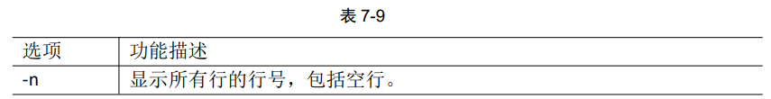

> 注：
>
> - 一般查看比较小的文件，一屏幕能显示全的

#### 1.11 more

功能描述：文件内容分屏查看

>more 指令是一个基于 VI 编辑器的**文本过滤器**，它以全屏幕的方式按页显示文本文件的内容。more 指令中内置了若干**快捷键**，详见操作说明。
>
>> 就像是进入了vi编辑器的状态，当然只能查看，甚至无法查找关键字

基本语法：`more 要查看的文件`

操作说明：

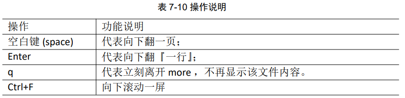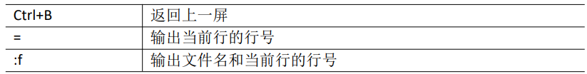

> 按f(forward)和b(back)也可以向前向后翻页

#### 1.12 less

less 指令用来分屏查看文件内容，它的功能与 more 指令类似，但是比more 指令更加强大，支持各种显示终端。less 指令在显示文件内容时，并不是一次将整个文件加载之后才显示，而是**根据显示需要加载内容**，对于显示**大型文件**具有较高的效率。

基本语法：`less 要查看的文件`

操作说明：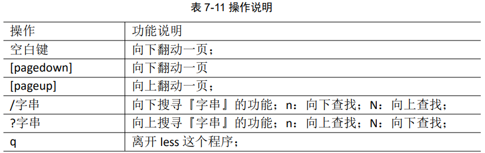

> 注：
>
> - 与`more`查看模式下的操作类似
> - 通过k和j也可以上下滚动，还有其他vim中的上下滚动操作基本都支持

#### 1.13 echo

功能描述：输出内容到控制台

基本语法：`echo [选项] [输出内容]`

选项说明：

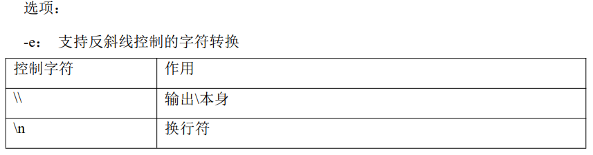

>注：
>
>- 相当于`print`，输出的内容可以**用双引号包裹**
>
>- 输出的内容允许出现**空格**，但多个空格只会输出一个，除非**用双引号包裹**
>
>- 当然，用**双引号包裹**时，大部分反斜杠和转义也会原样输出，除非是`\"`输出双引号
>
>  > 如果不用双引号包裹的话，许多转义也会失效，所以`-e`搭配<u>双引号</u>才是最完备的做法
>
>- 如果想识别双引号中所有转义字符，需要使用`echo -e`，注意`ehco`与`-e`必须挨着，`-e`不能放在输出内容后面

> echo和文件能有什么关系？
>
> echo既然可以输出到控制台，当然也可以将输出**<u>重定向</u>**至文件中，这就涉及到接下来要介绍的命令了

> 应用举例：
>
> - 用`echo`查看系统环境变量：
>   - 先在控制台输入`echo $`，再按两下`tab`，可以查看到所有环境变量

#### 1.14 head

功能描述：显示文件的开头部分内容，默认情况下 head 指令显示文件的前10 行内容

基本语法：

- `head 文件`
- `head -n number 文件`：查看文件前`number`行内容，`number`可以是任意行数

#### 1.15 tail

功能描述：输出文件中尾部的内容，默认情况下 tail 指令显示文件的后10 行内容

基本语法：

- `tail 文件`

- `tail -n number 文件`：查看文件尾部`number`行内容，`number`可以是任意行数

- :star:`tail -f 文件`：实时追踪该文档的所有更新

  > 注：
  >
  > - f：follow
  >
  > - 当然，在一个终端输入这个命令后会停下等待，需要与其他终端配合才能看到效果
  >
  > - 这里追踪的是在末尾的追加信息，如果是覆盖了之前的内容，则会提示文件被截断
  >
  > - 按Ctrl S可以暂时停止追踪，但不退出，按Ctrl Q可以继续追踪，并将暂停期间追加的数据都 显示出来
  >
  > - 按Ctrl C可以退出
  >
  > - 一般来说，能够追踪到的更新都是通过`>>`来换行追加的。如果是直接用vim更新，则不会追踪到
  >
  >   > 因为使用vim更新时，**文件索引号**会发生变化（相当于变成了另外一个文件），`tail -f`无法继续根据**索引号**去追踪了

选项说明：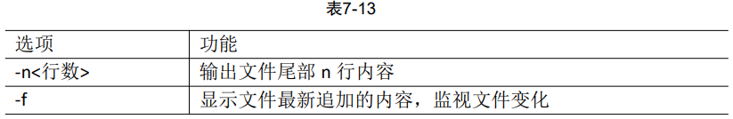

#### 1.16 >和>>

功能描述：

- `>`：输出重定向，覆盖
- `>>`：输出重定向，追加（会**自动换行**）

基本语法：

- `命令 > 文件`
- `命令 >> 文件`

> 具体应用举例
>
> - `ls -l > 文件`：列表的内容写入文件 a.txt 中（**覆盖写**）
> - `ls -al >> 文件`：列表的内容**追加**到文件的末尾
> - `cat 文件 1 > 文件 2`：将文件 1 的内容**覆盖**到文件2
> - `echo “内容” >> 文件`：将“内容”追加至文件中
>
> > 如果文件原来不存在，可以直接创建出来

#### 1.17 ln -s

ln：link

**软链接**也称为**符号链接**，类似于 windows 里的**快捷方式**，有自己的数据块，主要存放了链接其他文件的路径。

功能描述：给原文件(夹)创建一个**软链接**

> 软链接也是一种特殊的**文件**，用`ll`或`ls -l`查看其类型，发现其是<u>以`l`开头</u>的，尾部会显示位置指向；
>
> 如果链接的是一个目录，那这个软链接自己也就像一个目录那样，可以进入，可以查看其中的内容，并且使用`pwd`的时候是**软链接所在路径**，而不是原路径，如果想查看**原路径**，需要加入`-P`参数，即`pwd -P`

基本语法：`ln -s [原文件或目录] [软链接名]`

> 注：
>
> - 这个`-s`是必须要加的，s：soft
>
>   > 如果不加`-s`，那就是**硬链接**，并不是一个**新文件**，本质上是指向文件`inode`的链接
>   >
>   > > 这个涉及到Linux底层文件存储原理了：
>   > >
>   > > 文件名$\overset{指向}{\rarr}$文件的inode$\overset{指向}\rarr$文件数据
>   > >
>   > > 硬链接：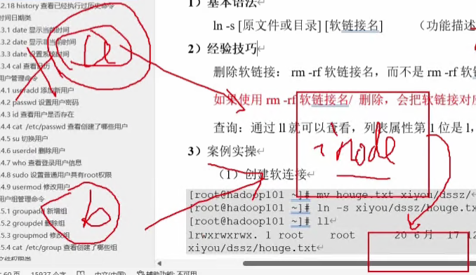
>   > >
>   > > 软链接：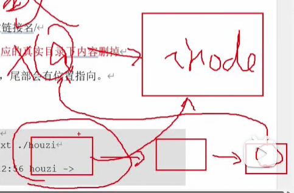
>   > >
>   > > > **当前文件链接数**，指的就**是硬链接的数量**
>   > >
>   > > 硬链接实际应用比较少，因为直接和文件inode相关，也没办法创建目录的链接
>
> - 比如之前提到的`/bin`、`/sbin`其实就是软链接
>
> - 删除软链接： `rm 软链接名`，而不是` rm 软链接名/ `
>
>   > 如果使用 `rm 软链接名/` 删除，会把软链接对应的**真实目录下的内容**删掉，相反软链接不会被删除。
>   >
>   > 因为不加`/`只代表**软链接文件**，加了`/`就代表访问相应**目录**了
>
> - 如果软链接指向的文件或目录被删除了，则软链接失效，会提示`没有那个文件或目录`

#### 1.18 history

功能描述：查看已经执行过历史命令

基本语法：

- `history`
- `history number`：显示过去执行过的`number`条命令
- `history -c`：清空历史命令记录

> 补充：再次执行过去执行过的命令
>
> - 通过`history`查看其编号
> - 通过`!编号`再次执行该命令

---

### 2、时间日期类

基本语法：`date [OPTION]... [+FORMAT]`

选项说明：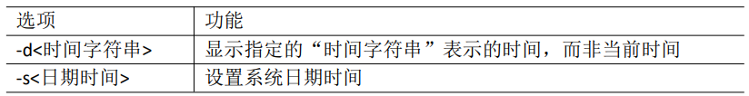

参数说明：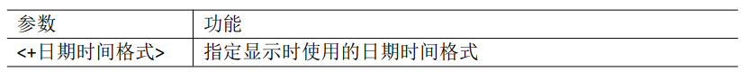

date显示当前时间：

- `date`：显示当前时间

- `date +%Y`：显示当前年份

  > 注意这个**加号**是要输入进去的

  > 将大写Y换成小写y则是只显示年份后两位

- `date +%m`：显示当前月份

- `date +%d`：显示当前是哪一天

- `date +%s`：显示当前时间戳（单位是秒）

- `date "+%Y-%m-%d %H:%M:%S"`：显示年月日时分秒

  > 如果中间要加空格的话就需要用双引号括起来

date显示非当前时间：

- `date -d '1 days ago'`：显示前一天时间

  > 当然`days`也可以换成`hours`等

- `date -d '-1 days ago'`：显示明天时间

设置系统时间：

- `date -s 字符串时间`

  > 举例`date -s "2017-06-19 20:52:18"`

- `ntpdate 同步时钟的服务器`：同步时钟

cal查看日历：

> cal：calendar

- `cal [选项]`：不加选项，显示本月日历
- `cal -3`：查看**前一月、当月和下一月**的时间
- `cal -m`：将**周一**放在前面显示日历 
- `cal -y`：查看**本年度**日历
- 选项说明：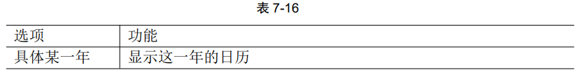

---

### 3、用户管理类

> Linux是多用户、多任务的分时操作系统，可能会有多个用户同时操作，需要对用户进行管理

#### 3.1 useradd

功能描述：添加新用户

> 当然只有root用户有权限进行创建新用户和设置密码等操作

基本语法：

- `useradd 用户名`：添加新用户

  > 可以对用户的主文件夹进行命名，可以使用`mv`命令，也可以在添加用户时进行设置：
  >
  > - `useradd -d 主文件夹位置 用户名`
  > - 当然这只是改了主文件夹的名，登录时要用的用户名不变

- `useradd -g 组名 用户名`：添加新用户到某个组

#### 3.2 passwd

功能描述：设置用户密码

基本语法：

- `passwd 用户名`

  > 应用举例：
  >
  > ```c
  > [root@hadoop200 home]# passwd tony
  > 更改用户 tony 的密码 。
  > 新的 密码：
  > 无效的密码： 密码少于 8 个字符
  > 重新输入新的 密码：
  > passwd：所有的身份验证令牌已经成功更新。
  > ```

#### 3.3 id

功能描述：查看用户是否存在

基本语法：`id 用户名`

> 注意这个用的是**用户名**，而不是**用户主文件夹名**

> 举例：
>
> ```c
> [root@hadoop200 home]# id tony
> uid=1001(tony) gid=1001(tony) 组=1001(tony)
> ```
>
> gid是用户组id，这个之后会解释

#### 3.4 cat /etc/passwd

功能描述：查看创建了哪些用户

> 注：
>
> - 执行该命令后，会出现很多用户，许多都是系统自动创建的用户，用来运行系统服务，这些用户称为**系统用户**或**伪用户**，不能登录
>
> - root用户在第一个，创建的其他普通用户在最后几行，uid从1000开始
>
> - 输出的信息格式：`用户名:x:uid:gid::用户主目录:用户与系统交互的方式`
>
>   > 普通与系统交互的方式：`/bin/bash`

#### 3.5 su

su：switch user

功能描述：切换用户

> **普通用户**向其他用户切换时需要输入密码。并且普通用户也不能查看其他用户的**主目录**

基本语法：

- `su 用户名称`：切换用户，只能获得用户的执行权限，不能获得**环境变量**
- `su - 用户名称`：切换到用户并获得该用户的**环境变量**及执行权限

> 注：
>
> - 使用`su`切换用户，本质上是**会话的嵌套**，所以也可以退出嵌套的会话，只需要使用`exit`即可


---

### 4、文件权限类


---

### 5、磁盘分区类


---

### 6、进程线程类


---

---

## 扩展篇

---

### 1、软件包管理


---

### 2、克隆虚拟机


---

### 3、Shell编程